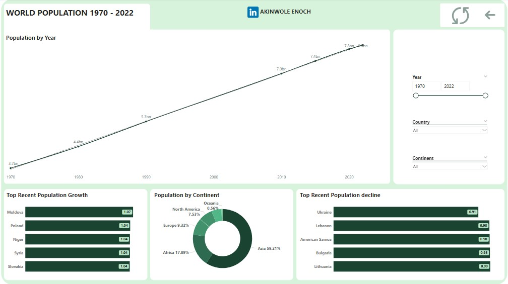

# Data Analysis Project: World Population Analysis (1970-2022)

## Overview
This project analyzes global population data from 1970 to 2022 to uncover trends, patterns, and insights about population distribution, density, and growth across countries and continents. The dataset includes information on population, land area, and density for countries worldwide. The analysis answers critical questions about population dynamics, such as the most densely populated countries, population growth trends, and continental comparisons.

---

## Key Questions Answered
1. **What is the total number of countries in each continent?**
2. **What is the top 10 most densely populated countries in 2022?**
3. **What are the countries with the largest population in each continent in 2022?**
4. **What continent has the largest land area?**
5. **Which countries have a population above the global average in 2022?**
6. **What are the top 10 most populated countries in 2022?**
7. **Which countries experienced a population decline between 2020 and 2022?**

---

## Visualization
- **Images**:(worldpopulation1.jpg)
- **Link**:(https://app.powerbi.com/view?r=eyJrIjoiMDk1YWM1NGUtMTQ0Yy00OTNjLWIxNjgtYThlNDA2YzExMWExIiwidCI6IjA4NjdkMjY1LWY2YmYtNGYxYi1iOTRkLTZkMzBkZGZiNTk1NCJ9) (Replace with the actual source or link to the dataset)
- **Columns Included**: Country, Continent, Year, Population, Land Area (km²), Population Density (per km²), etc.

---

## Tools and Technologies
- **Programming Language**: SQL
- **Visualization tool**: Power BI
